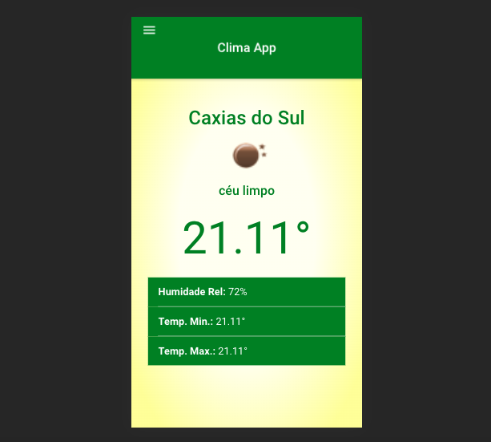

# Ionic Clima App



![version][version-badge] ![Idioma][idioma] ![status][status-emprogresso] ![License][license-badge]

Please, give a ⭐ to the repo. It really motivates me to share more open source code.

# Get Started
This project was generated with [IONIC](https://ionicframework.com/docs/angular/your-first-app) version 5.0.5 and [NodeJS](https://nodejs.org/en/) version 12.16.1 LTS.

### Para rodar este projeto é necessário
#### Clonar o repositório
```javascript
$ git clone https://github.com/TomCosta/ionic-weather.git
``` 
#### Entrar na pasta do projeto
```javascript
$ cd clima
``` 
### Reinstalar as dependências
```bash
$ npm install
```
### Rodar localmente no navegador
```bash
$ ionic serve
```

### Criar uma conta e solicitar chave de API na [Open Weather](https://openweathermap.org/)
No arquivo `apiweather.service.ts` inclua a sua chave/key da Api
```bash
const key = 'YOUR_API_KEY';
```

### ------------------------------------------------------------------
# Se não tiver o Ionic instalado

### Below follows the example to use this code to build an app.

## How to use this template

### With the Ionic CLI:

Use command below:

```bash
$ sudo npm install -g ionic cordova
```

Then, to run it, cd into `sports` and run:

```bash
$ ionic cordova platform add ios
$ ionic cordova run ios
```

Run `ionic serve` for a local dev server. Navigate to `http://localhost:8100/`. The app will automatically reload if you change any of the source files.
```bash
$ ionic serve
```

# Extras
## Gerar componentes, pipes, services, etc.
### Run 
```javascript
ionic generate component `component-name` to generate a new component
```
### You can also try anything else:
```javascript
ionic generate `directive|pipe|service|class|guard|interface|enum|module`
```

Substitute ios for android if you are not on a Mac system.

#
## Show Support
* [Recommend Me On LinkedIn](https://www.linkedin.com/in/costaeverton/) - I will realy love your support.
* And also don't forget to star ⭐ this repo, it's FREE. 🙃

[CHANGELOG]: ./CHANGELOG.md
[version-badge]: https://img.shields.io/badge/version-1.0.0-blue.svg
[license-badge]: https://img.shields.io/badge/license-MIT-blue.svg
[status-emprogresso]: https://img.shields.io/badge/status-Em%20progresso-blueviolet
[idioma]: https://img.shields.io/badge/idioma-Portugu%C3%AAs-800060

